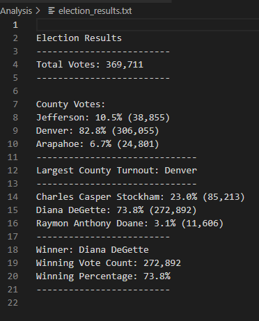
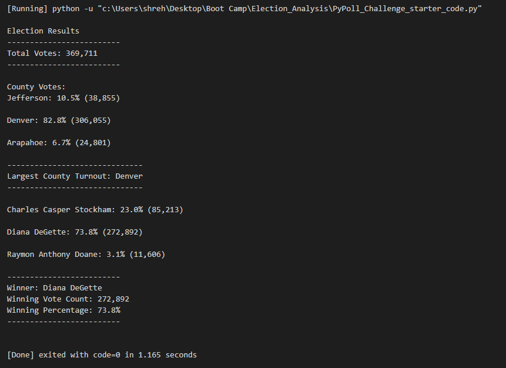

# Election_Analysis
Performing Analysis on Kickstarter data to uncover trends. 

## Table of Contents
- [Overview of Project](#OverviewProject)
  * [Background](#Background)
  * [Purpose](#purpose)
- [Pseudo Code](#Pseudocode)
  * [Analysis based on Category](#AnalysisCategory)
- [Election Audit Results](#results)
    * [Total Votes Casted](#Totalvotes)
    * [Election Results per Candidate](#CandidateResults)
    * [Election Results per County](#CountyResults)
    * [Election Results report in Text File](#textResults)
    * [Election Results report on Terminal](#terminalResults)
- [Election Audit Summary](#Summary)
- [Resources](#resources)

## Overview of Project
### Background
I am assisting a Colorado Board of elections employee in an election audit of a recent local congressional election. There are 3 primary voting methods:
1. Mail-in Ballots: These votes are **hand-counted** at the central office.
2. Punch Cards : These are collected and then fed into a machine that tabulates vote totals and sends the resuts to the central office. These are **Machine counted.**
3. Direct Recording Electronic(DRE): Memory cards from DRE counting machines are sent to central office and read by computer. These are **Computer counted.**

The total votes cast by these three methods determine the final Election Results.

### Purpose

The total votes casted by the three methods have been populted in the excel file named [election_results.csv](election_results.csv).
I am tasked to do the following:
1. Total number of votes cast
2. The total number of votes for each candidate
3. The percentage of votes for each candidate
4. The winner of the election based on the popular vote.
5. The voter turnout for each county.
6. The percentage of votes from each county out of the total count.
7. The county with the highest turnout

 This process is usually done using Excel. But we would automate this process by using **Python**. **Our job is to generate a vote count report to certify this US congressional race.**

## Pseudo Code

## Election Audit Results

### Total Votes casted

The total votes casted this election : ***369,711*** </n> 

### Election Results per Candidate

The table below shows the election results **per candidate**:

         Candidates        |  Total Votes  |  % Votes
    -----------------------|-------------  |---------
    Charles Casper Stockham|   85,213      |  23.0%
    Diana DeGette          |  272,892      |  73.8%
    Raymon Anthony Doane   |   11,606      |   3.1%  

**Winning Candidate**: ***Diana DeGette*** received ***73.8%*** of the vote and ***272,892*** of total votes. 

### Election Results per County

The table below shows the election results **per county**:

        County Name     |  Total Votes  |  % Votes
    --------------------|-------------  |---------
          Jefferson     |    38,855     |   10.5%
          Denver        |   306,055     |   82.8%
          Arapahoe      |    24,801     |    6.7%  

**Winning County**: ***Denver*** with an ***82.8%*** vote of the total count and ***306,055*** of total votes. 

### Election Results report in Text File

  
 

### Election Results report on Terminal

  
 

## Election Audit Summary
There is a statement to the election commission that explores how this script can be used for any election, with two examples for modifying the script. (4 pt)

There are vrious advantages of using **python** over excel. Few of them are listed below:
* Automation of code 
* Reusability of code
* Faster execution
* Easy to write and read the code

This code can be reused by Election Comission for any election by just changing a few lines of code. Below are the few changes that can be done to further automate the process:
1. We can modify the code to get the winning candidate in each county.
2. A much larger dataset can be used containing the election data not only for Colorado, but for other states as well. This way we can create a report of the winning candidates for all states.
3. The input file being read in the code is a CSV file. We can change the code to read a file in any format such as JSon,xls,txt by importing the proper dependencies.

##  Resources
[1] [Code for Election Analysis](Pypoll_challenge.py) 
[2] [Election Data](election_results.csv) 
[3] [Election Results Printed to Command Line](terminal_results.png)
[4] [Election Results Saved to Text File](election_results.txt)
[5] Software: Python 3.10.2, Visual Studio Code 1.64.2
